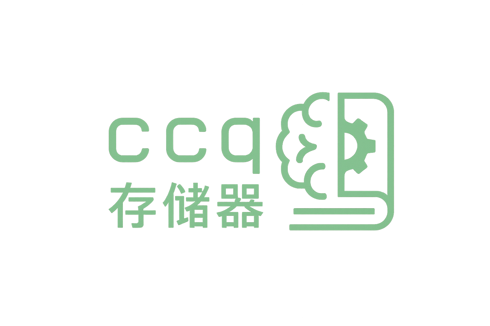

**ccq: 存储器**, or "Chinese C queries", "Chinese card quizzer", ...

CLI spaced repetition and dictionary tool for Chinese


**compilation**

no dependencies:

```sh
cc -o main main.c -lm
```


**data files**

a database of dictionaries to be moved to
```
~/.local/share/ccq/db.bin
```

a study list, to be created in

```
~/.local/share/ccq/zh
```

the latter has format:

EPOCH|FSRS|FRONT|BACK\n

* EPOCH: 10-digit Unix timestamp
* FSRS: reps;stab;diff (e.g., 00;0250;0500)
* FRONT: key
* BACK: definition


**usage**

 * ccq -q <key> : add a word if in db and not already in study list
 * ccq -r       : review due cards in random order
 * ccq -n       : review newest due cards first
 * ccq -o       : review oldest due cards first

during review:

 * press any key to flip
 * press [enter], [p], [P], or [space] to mark as passed
 * any other key counts as failed
 * reschedules based on fsrs algorithm
